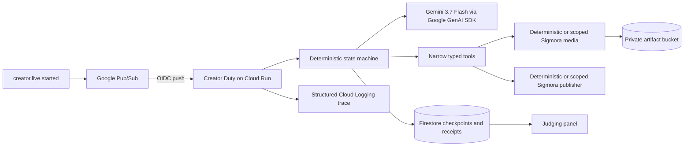

# Creator Duty by Sigmora

[](https://github.com/mlsniperpro/sigmora-creator-duty/actions/workflows/ci.yml)

**Stay live. Creator Duty handles the campaign.**

Creator Duty is an event-driven agent that turns one livestream event into a
produced, validated, distributed, verified, and recoverable campaign while the
creator stays with the audience.

It is the Taskmaster entry for the 2026 All Things Agentic Hackathon.

[Open the live Cloud Run judging panel](https://creator-duty-ra3flcxmjq-uc.a.run.app),
[browse the public source](https://github.com/mlsniperpro/sigmora-creator-duty),
or inspect the [verified cloud evidence](docs/cloud-evidence.md), including the
real Gemini trace, immutable promo hash, receipts, failure recovery, exact
replay, post-live recap, and three-run measurements.

Competition scope: Creator Duty and its Google-native agent stack are new work
for this hackathon. Sigmora is a pre-existing proprietary creator platform and
is not presented as competition-created work. See the
[new-work disclosure](docs/new-work-disclosure.md).

## The personal friction

Going live is when I should be most present, but it creates a second job at the
worst possible moment: find a promotional moment, render a vertical asset,
rewrite the announcement for each channel, validate every release, publish,
check failures, avoid duplicates, and prepare the recap. A chat box would still
make me supervise that checklist.

Creator Duty starts from `creator.live.started`, not a prompt. Once the event is
inside its preauthorized demo boundary, it owns the workflow through verified
receipts. One destination deliberately fails once; only that target is retried.
Replaying the original event creates no second campaign or post.

## Exact implementation lock

| Role | Exact implementation |
| --- | --- |
| Primary model | `gemini-3.7-flash` on Vertex AI |
| Google agent framework | Official Google GenAI SDK, `@google/genai` `2.19.0` |
| SDK path used | `GoogleGenAI` → `models.generateContent` with structured JSON output |
| Runtime | Cloud Run, Node.js 24 container |
| Event transport | Pub/Sub authenticated push |
| Durable state | Firestore transactions and idempotency ledgers |
| Artifact storage | Private Cloud Storage bucket |
| Local judge mode | Deterministic model, media, and publishing providers |

Google documents `gemini-3.7-flash` as a generally available model with
structured output support. The requested model, resolved model version,
response ID, token counts, and timestamp are recorded for real calls. The local
deterministic provider is reproducible test infrastructure; it is never
presented as Google-model evidence.

Veo (`veo-3.1-generate-preview`) and Lyria (`lyria-3-clip-preview`) adapters are
present but disabled by default. Source code and configuration do not constitute
an exercised integration or a bonus claim. They may be claimed only after the
relevant path completes in a recorded run and its model and operation receipts
are preserved. Gemma is treated the same way and has no default model ID.

## Five-minute local setup

Requirements: Node.js 22 or newer. The container and CI use Node.js 24.

```bash
npm ci
npm test
npm run demo
```

The local path uses safe defaults without reading an environment file;
`.env.example` is a deployment/configuration reference.

`npm run demo` uses synthetic fixtures and deterministic providers. It makes no
Google or Sigmora network call, needs no credentials, and writes no public post.
The expected run shows:

1. one event claimed and one campaign created;
2. a typed plan and distinct channel variants;
3. a real 9:16 deterministic promo artifact;
4. deterministic policy validation before release;
5. one target-specific transient failure and retry;
6. verified per-channel receipts;
7. `duplicate_ignored` after replay; and
8. a post-live recap after `creator.live.ended`.

For the local judging panel:

```bash
ALLOW_DEMO_TRIGGER=true npm run demo:server
```

Then open `http://localhost:8080`. The ordinary UI and deterministic demo work
without a WebMCP client, private platform credentials, or a cloud account. The
local demo gate is explicit; production additionally requires the Secret
Manager demo key.

## Architecture



The model makes bounded creative choices. It never receives credentials and
never writes raw prose directly to a publisher. The state machine, immutable
release hash, deterministic policy, preauthorization profile, and idempotency
ledger retain authority over side effects.

See [architecture](docs/architecture.md) and
[security boundary](docs/security.md) for the full contracts.

## Cloud deployment

The deployment is intentionally explicit and does not run from CI.

```bash
gcloud auth login
export PROJECT_ID="$(gcloud config get-value project)"
bash infra/deploy.sh
```

The script enables the required APIs, creates dedicated runtime and push
identities, a private artifact bucket, Artifact Registry repository, Firestore
database, Pub/Sub topic and authenticated push subscription, and a Secret
Manager demo key. It builds and deploys Cloud Run with zero minimum instances,
a bounded maximum instance count, disabled optional models, and a fail-closed
limit on the plan's estimated model budget. A durable daily demo quota and
cooldown provide the production spend guardrail; neither is a billing cap. The
script never prints the demo key.

Read [deployment](docs/deployment.md) before running it. Deployment changes a
real Google Cloud project and can incur charges.

## Judge path

Start with [the judging guide](docs/judging.md). The shortest reproducible path
is:

```bash
npm ci
npm test
npm run demo
```

For cloud evidence, the guide maps one run ID across the Cloud Run URL, Cloud
Logging trace, Firestore campaign, immutable artifacts, receipts, injected
failure, and replay rejection. Claims are accepted only when the corresponding
evidence exists; the [evidence checklist](docs/evidence-checklist.md) is the
release gate. Current external proof is tracked without placeholders in
[evidence status](docs/evidence-status.md).

## Repository map

- `src/domain` — strict event and campaign records.
- `src/models` — deterministic and Google GenAI SDK model adapters.
- `src/orchestration` — explicit campaign state machine and workflow.
- `src/tools` — narrow tools and deterministic release policy.
- `src/providers` — synthetic source, media, event, and publishing boundaries.
- `src/storage` — concurrency-safe memory store and transactional Firestore store.
- `src/web` — authenticated HTTP and compact judging surface.
- `fixtures` — synthetic start, end, transcript, and failure fixtures.
- `infra` — reviewable Google Cloud deployment scripts; never auto-deployed.
- `docs` — architecture, trust, deployment, judging, disclosure, and evidence.

## Verification

```bash
npm run check
node scripts/scan-release.mjs
bash -n infra/deploy.sh
```

CI runs the same typecheck, tests, deterministic end-to-end demo, build, shell
syntax check, and release scan. The scanner rejects likely secrets, unresolved
submission markers, drifting primary model IDs, and model IDs outside this
repository's reviewed allowlist.

## New work and disclosure

Creator Duty was started on August 29, 2026 for the All Things Agentic
Hackathon. Sigmora is a pre-existing proprietary creator platform with media
generation, rendering, and publishing capabilities. The new work in this
repository is the Google-native Creator Duty agent, event contract,
orchestration, Pub/Sub and Cloud Run integration, Firestore state model, scoped
tool/provider boundaries, deterministic simulator, failure and replay fixtures,
judging surface, tests, documentation, and deployment configuration.

This repository does not claim that the pre-existing Sigmora platform was built
during the competition. Synthetic data and sandbox publishing are labeled. See
[the full disclosure](docs/new-work-disclosure.md).

## License

The competition-created code in this repository is licensed under Apache-2.0.
The license does not grant rights to Sigmora's pre-existing service, private
source, credentials, customer data, trademarks, or brand assets.

Official references: [Gemini 3.7 Flash](https://ai.google.dev/gemini-api/docs/models/gemini-3.7-flash),
[Google GenAI SDK on Vertex AI](https://docs.cloud.google.com/vertex-ai/generative-ai/docs/start/quickstart),
[authenticated Pub/Sub push](https://cloud.google.com/pubsub/docs/authenticate-push-subscriptions),
and [Cloud Run service identity](https://cloud.google.com/run/docs/configuring/services/service-identity).
