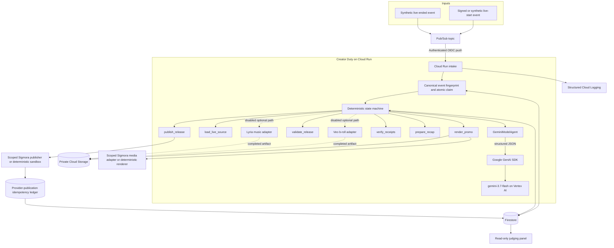
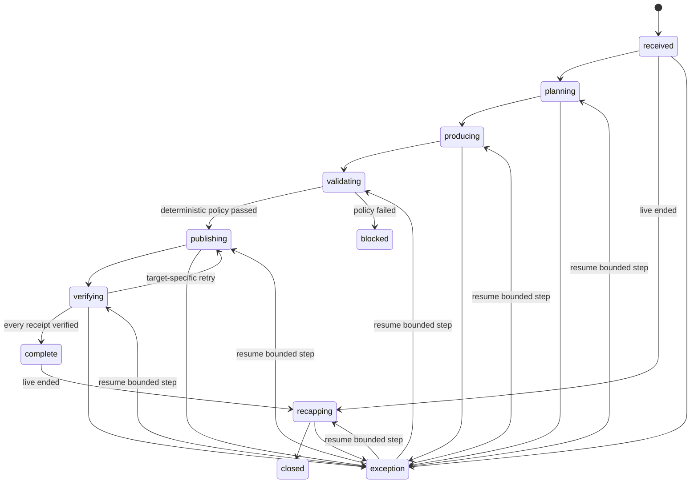

# Architecture and execution contract

Creator Duty is one bounded, durable workflow. It is not a collection of agents
passing prose to one another. Pub/Sub delivers an event, Cloud Run owns the
state machine, Gemini makes typed creative decisions, narrow tools isolate side
effects, and Firestore preserves enough state to resume safely.

## System view

## State machine

Every transition is checked in code. `complete` can move only to `recapping`;
`closed` and policy `blocked` have no outgoing transition. An exception can
resume only at an explicitly allowed bounded step.

## Event claim and replay semantics

`claimEvent(event, initialCampaign)` is a transaction, not a check followed by
an insert.

- A canonical JSON SHA-256 binds each event ID to its complete payload.
- The first start event creates one event claim, one campaign, and the stream
  index in the same Firestore transaction.
- Concurrent deliveries of that event resolve to the same campaign.
- An exact replay resumes a campaign that has not completed.
- An exact replay of a `complete` or `closed` campaign returns
  `duplicate_ignored`.
- Reusing the event ID with different content is rejected as an integrity
  error.
- A new live-ended event attaches to the existing stream campaign, then replay
  protection applies to the end-event ID independently.

## Model boundary

The primary production adapter constructs `GoogleGenAI` with Vertex AI enabled,
the explicit project and `global` location, then calls
`models.generateContent`. Each call supplies:

- an exact model ID: `gemini-3.7-flash`;
- a bounded system instruction and task prompt;
- a reduced Google-compatible JSON response schema;
- a runtime Zod schema that remains authoritative for all constraints; and
- a supported thinking level, with model thoughts excluded from evidence.

The agent rejects missing response IDs or resolved model versions. Recorded
evidence contains the requested and resolved models, response ID, finish reason,
token counts when returned, SDK surface, provider, and timestamp.

Optional media adapters are isolated from the required path. Veo uses the
official SDK long-running video API; Lyria uses the authenticated Vertex
Interactions endpoint. Both persist exact model, operation, prompt, artifact,
and hash evidence when they complete. They remain disabled in the base cloud
deployment and must not be claimed from source code alone.

## Tool and authority boundary

| Boundary | Model may choose | Deterministic code controls |
| --- | --- | --- |
| Source | Moment and rationale within supplied transcript | Exact fixture/asset IDs and source duration |
| Campaign | Angle, hook, tone, per-channel copy | Allowed channel set, CTA URL, claim rules, estimated-plan budget limit |
| Media | Prompt-level creative intent | Immutable artifact ID/hash, duration, dimensions, provider scope |
| Release | No direct release authority | Validation record, release hash, preauthorization, idempotency key |
| Retry | No arbitrary replay | Failed target only, bounded attempts, committed-result reconciliation |
| Recap | Headline, summary, question clusters | Existing campaign and source questions only |

Raw model prose never enters a publishing adapter. The publisher receives a
typed channel variant, immutable artifact, validated release hash, and bounded
idempotency key.

## Storage layout

Firestore uses separate collections for campaigns, event claims, stream lookup,
and provider publications. The default names are:

- `creatorDutyCampaigns`
- `creatorDutyEventClaims`
- `creatorDutyStreamCampaigns`
- `creatorDutyProviderPublications`

Campaign records contain steps, model invocations, artifacts, validation,
receipts, recap, and measured run metrics. Event and provider ledgers are
write-once compare-and-set boundaries. The memory implementation mirrors these
semantics and deep-clones every input and output for deterministic tests.

No composite Firestore index is required. Latest campaign uses the automatic
single-field `createdAt` index; stream lookup uses the transactionally maintained
stream collection.

## Failure semantics

- A failure before provider commit is retryable for that destination only.
- A lost response after provider commit is ambiguous, so lookup runs before any
  retry.
- A stored idempotency key with different publication semantics is a hard
  conflict.
- Successful destinations remain checkpointed and are not called again.
- Pub/Sub receives a success response only after the intake has safely accepted
  or deduplicated the event; other responses allow redelivery.
- Optional external media paths are disabled in the deterministic P0 path, so
  they cannot prevent that base run from completing.

## Runtime modes

| Mode | Model | State | Media | Publishing | Purpose |
| --- | --- | --- | --- | --- | --- |
| Local default | deterministic fixture | memory | deterministic local render | process-local sandbox ledger | judge reproduction and tests |
| Cloud base | Vertex AI | Firestore | deterministic render with private bucket | durable sandbox | eligible autonomous cloud proof |
| Scoped Sigmora | Vertex AI | Firestore | narrow HTTPS adapter | narrow HTTPS adapter | controlled platform integration |

The cloud base mode is the required deployment baseline. Scoped Sigmora is
enabled only when dedicated credentials and endpoints have been configured.
