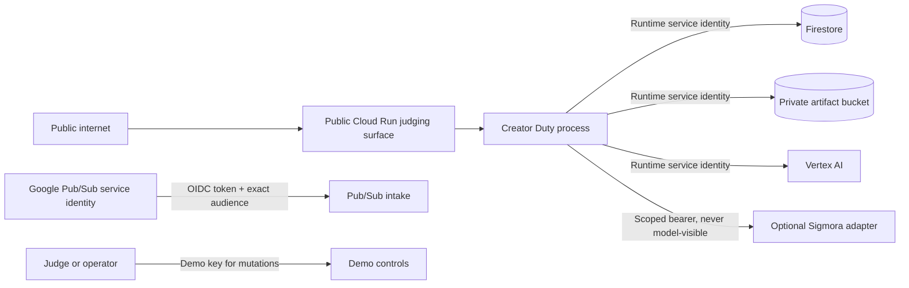

# Security and threat boundary

Creator Duty is autonomous only inside a narrow preauthorization profile. The
normal hero event does not pause for approval, but it also cannot expand its own
authority.

## Protected assets

- creator and workspace identity;
- live source metadata and transcript;
- Google Cloud credentials and project quota;
- Sigmora provider token;
- campaign drafts and immutable artifacts;
- publishing authority and external post identity;
- audit records, model evidence, and receipts.

## Trust boundaries

The Cloud Run service is public so a signed-out judge can view the product.
Public reachability is not mutation authority:

- Pub/Sub intake requires a Google-signed ID token for the configured audience.
- Demo mutation routes require a high-entropy Secret Manager value, compared in
  constant time.
- Production refuses unauthenticated Pub/Sub and refuses a missing demo key.
- Read-only health and judging views return no secrets or raw customer data.

## Threats and controls

| Threat | Control | Evidence |
| --- | --- | --- |
| Forged Pub/Sub delivery | OIDC verification plus exact `PUBSUB_AUDIENCE`, verified email claim, and exact push service-account identity; push identity also receives only Cloud Run Invoker | Subscription configuration and rejected unauthorized request |
| Poison Pub/Sub message | Strict schema/integrity classification, then success acknowledgement without workflow execution | API test and `invalid_event_ignored` response disposition |
| Same event delivered twice | Transactional event claim and canonical payload fingerprint | Concurrent claim test and `duplicate_ignored` replay |
| Same ID with changed payload | Stored SHA-256 of canonical event JSON | Integrity-error test/log |
| Duplicate external post after timeout | Persistent provider ledger; lookup after ambiguous write; stable idempotency key | Injected after-commit or retry fixture and one provider post ID |
| Model bypasses policy | Structured output is draft data; deterministic policy and release hash gate publishing | Validation record precedes every receipt |
| Prompt injection in transcript | Transcript is data, not system instruction; Zod output schema and source-bound checks | Model/tool boundary tests and trace |
| Credential exposure to model | Vertex uses application identity; Sigmora token exists only inside its adapter | Code inspection and release scan |
| Provider body leaks through public evidence | Remote error bodies are discarded; persisted steps use stable local status/error text only | Provider tests and public API inspection |
| Cross-creator action | Fixed demo creator and preauthorization profile; provider adapters accept typed campaign identity | Configuration and policy result |
| Unbounded spend or fan-out | Maximum four destinations, estimated-plan budget limit, one promo, optional models disabled, Cloud Run maximum instances, plus a durable daily demo-start quota and cooldown | Environment, quota transaction tests, and deployment configuration |
| Leaked demo key drives repeated model spend | Global Firestore transaction enforces a daily fresh-start cap and cooldown across all instances | Quota concurrency/rollover tests and production environment |
| Public artifact disclosure | Uniform bucket access, public access prevention, runtime-only object role | Bucket IAM and artifact `gs://` URI |
| Instance-memory exhaustion from media files | Staging directories and uploaded final files are removed after immutable object persistence | Provider tests and bounded Cloud Run memory |
| Browser/client writes to Firestore | Deny-all Firestore client rules; server client authorized with IAM | `firestore.rules` and runtime role |
| Secret committed to repository | Ignore rules, CI secret patterns, manual evidence review | Release scanner output |

## Service identities

The deployment creates separate identities:

1. **Runtime identity** — Datastore User for Firestore, Vertex AI User for the
   primary model, Pub/Sub Publisher on one topic, Object User on one bucket, and
   Secret Accessor on one demo-key secret.
2. **Push identity** — Cloud Run Invoker on one service and no application data
   role.
3. **Pub/Sub service agent** — Service Account Token Creator on only the push
   service account so Google can mint that identity's OIDC token.

The deployment operator needs broader create/deploy permissions, but those are
not granted to the runtime identity.

Firestore server libraries use IAM and bypass client security rules. The
deny-all rule is defense in depth for accidental browser/mobile client access;
the runtime role is the authoritative server boundary.

## Preauthorization profile

The demo permits only:

- creator `demo_creator`;
- the synthetic fixture source;
- at most four configured sandbox destinations;
- one 12–15 second vertical promo;
- a configured maximum for the model-authored spend estimate (not metered billing);
- release only after deterministic validation; and
- recap generation from the existing campaign.

It grants no account administration, credential access, deletion, direct
messages, moderation, hidden replies, or arbitrary URL fetching.

## Logging and privacy

Structured logs carry event, campaign, run, trace, step, tool, attempt, model,
and outcome identifiers. They must not contain bearer tokens, demo keys, raw
authorization headers, or private customer content. Synthetic demo content is
used for public evidence.

Analytics and evidence may record source/medium/content attribution, timestamps,
and aggregate run measures. They must not include email addresses or other
personal information.

## Residual risks

- A compromised deployment operator can change IAM or service configuration.
- Model availability, quota, and preview media services can fail independently.
- A scoped Sigmora provider is only as strong as its server-side authorization
  and idempotency implementation.
- Public judging availability can attract traffic; Cloud Run limits reduce cost
  but do not replace billing budgets and alerts.

Before a public demo, set a Google Cloud billing budget/alert, inspect all IAM
bindings, rotate the demo key, use synthetic accounts, and run the evidence
checklist.

Report security issues privately to the repository owner. Do not place secrets,
real learner/customer data, or exploit details in a public issue.
